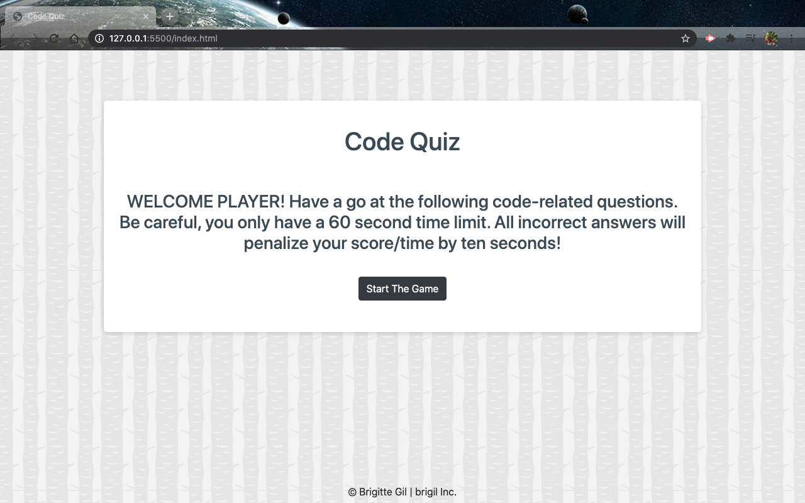

# Code-Game
In this homework I had the task of creating a multiple choice timed quiz game using javaScript. 

This quiz game starts in a click of a button. The player will be prompted with a series of multiple choice questions. If the player answers a question incorrectly the timer will deduct by 10 seconds. The players final results are calculated by the time left on the timer that was set at 60 seconds. The player will be able to submit their results and join the high score board by entering their initials at the end of the game. 

GOOD LUCK PLAYER ONE!

## Installation

There are no installations needed to play this game. The game should run in your browser on your computer.

 This Code Quiz Game is free to use for everyone.

 